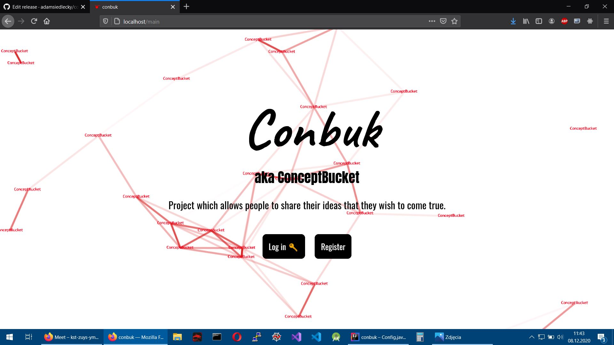
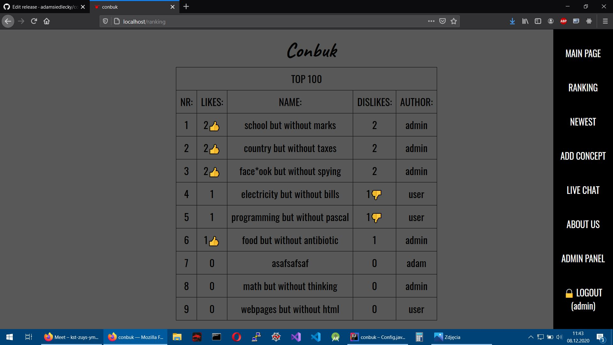

# conbuk
conbuk aka ConceptBucket is a project which allows people to share their ideas that they wish to come true.

Requirements to run:
- computer
- Java 11

How to run:
- download conbuk .jar file from the right panel on GitHub repo (releases section)
- go into terminal
- execute (nameOfTheJar is file name): ```cmd java -jar nameOfTheJar.jar ```
- go to browser: http://localhost:80
- login or register (you can use default *admin admin* and *user user* accounts)

Technologies used:
- Java
- Spring Boot with Spring Security
- Thymeleaf
- H2 db
- JPA/Hibernate
- particlesjs by VincentGarreau https://github.com/VincentGarreau/particles.js/
- Javascript
- HTML
- CSS
- web sockets (live chat)
- C++ (.ino script for esp)

Visualisation:
<br>

<br>

